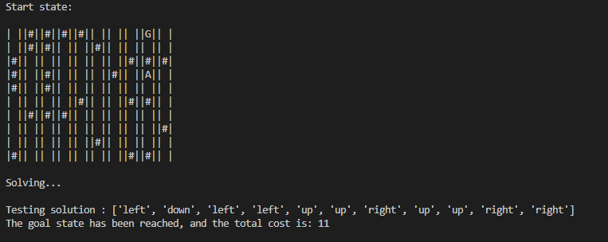

# AI-Agents-for-Search-Problems
A search problem is defined as a graph of node (states) and weighted edges (action leading from one state to another and costing a cost) where the goal is to find a certain goal state while minimizing the cost if possible. A good example is the pathfinding problem where your agent want to find the shortest path to a certain location. 
These problems can be partially solved using easy to implement graph algorithms adapted to the model-free nature of those problems (we don't know every states but rather discover them during the exploration of the state space).



## Package SearchProblemsAI
An implementation in python of some algorithms for search problems such as A*, that can be applied to any problem object that follow the SearchProblem interface.

The main feature is to define relatively quickly your concrete search problem as a subclass of the interface SearchProblem in order to solve it using already implemented algorithms. Some of those algorithms including BFS, DFS, Uniform Cost Search (Dijkstra ) and A* are already implemented.

## Installation :
Run this command to install the package SearchProblemAI:

    pip install SearchProblemsAI

## Using the package 
An example of how to use those algorithms once you have defined your SearchProblem can be found in example.py or here :

```python
from SearchProblemsAI.search_problems.FindCandy import FindCandyProblem
from SearchProblemsAI.SearchAlgorithms import DFS, BFS, IDDFS, UCS, A_star
from SearchProblemsAI.utils import manhattan_distance

#Define problem
problem = FindCandyProblem()
print("Start state:")
print(problem.get_start_state())

#Define algorithm solving it, solve it
def h(state):
    return manhattan_distance(state.pos, problem.goal_pos)
algo = A_star(heuristic = h)
list_of_actions = algo.solve(problem)

#Test the solution
print("\nTesting solution :", list_of_actions)
problem.apply_solution(list_of_actions)
```

The search problems have to be deterministic : one action in one state always leads to exactly one state.


## Define your search problem

The main interest of this package is to be able to quicly define your search problem and then use already implemented algorithms on it. Here is how to define your search problems.

```python
from SearchProblemsAI.SearchProblem import State, SearchProblem

class YourState(State):
    pass
    
class YourSearchProblem(SearchProblem):  
    pass
```

You need to first define your state class that must inherit the State class. A state represent a state of the problem with every information you are giving to the agent. Please implements the following methods, as well as the __str__ method eventually :

    __hash__()  : a state should be hashable
    __eq__(state : State) : two state should be comparable
      
Then you must define your search problem class. Every search problem class must inherit the class SearchProblem and implements the following methods :

    get_start_state() -> State                                                : return the initial state
    is_goal_state(state : State) -> bool                                      : return whether the state is a goal state
    get_actions(state : State) -> List[Action]                                : return the list of actions available in a given state
    get_transition(state : State, action : object) -> Tuple[State, float]     : return a tuple (next_state, cost_of_action) that represents the transition
      
A path finding problem can be found in ./search_problem/FindCandy.py as an example.
      

## Define your search algorithm
Some algorithms are already implemented.
```python
from SearchAlgorithms import DFS, BFS, IDDFS, UCS, A_star
```

But you can also define other search algorithms by inheriting the SearchAlgorithm class and implements the abstract required method : solve. Example can be found in ./searchAlgorithms.py

    solve(problem : SearchProblem) -> Union[List[object], None]               : return the sequence of actions leading to a goal state, or None if no solution found.


## Solve your search problem
Once it is done, you can solve your problem by using method .solve() on an instance of your search problem class.
````python
problem = YourSearchProblem(*args)
list_of_actions = DFS().solve(problem)
problem.apply_solution(list_of_actions)
````

## Improvements and limitations
Many other search algorithms are yet to be implemented.

A wrapper transforming a searchProblem object in a sensorless problem that can be interpreted as a more complex search problem is implemented but I'm not sure it is working. A sensorless problem is a search problem where you don't know the state you are in, and you need a sequence of action that always lead to a goal state no matter where you start. 

This package is limited to deterministic search problem, ie a given action in a given state always lead to the same next state. Algorithms for non deterministic search problems exist, returning a plan (a policy giving what to do in any state) rather than a sequence of actions, but are not yet implemented successfully.

A benchmark of all the algorithms existing and their performance in time and space complexity with regards to different problem parameters such as branching factor or solution's depth could be interesting.
